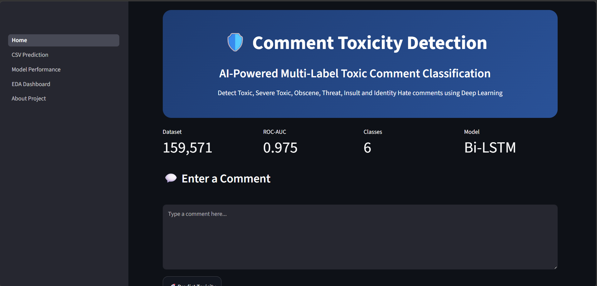
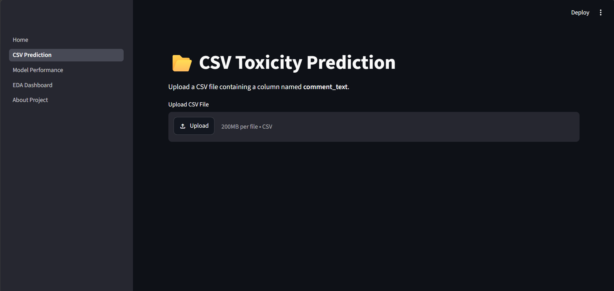
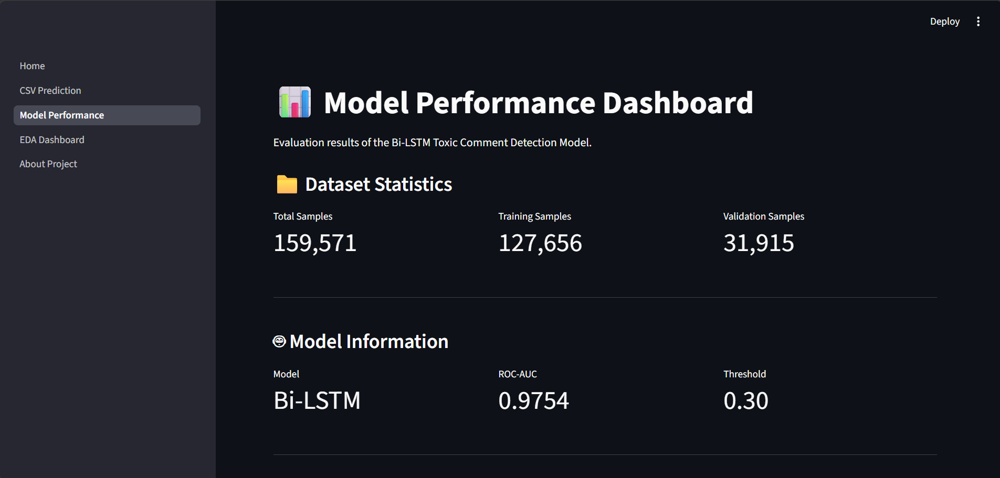
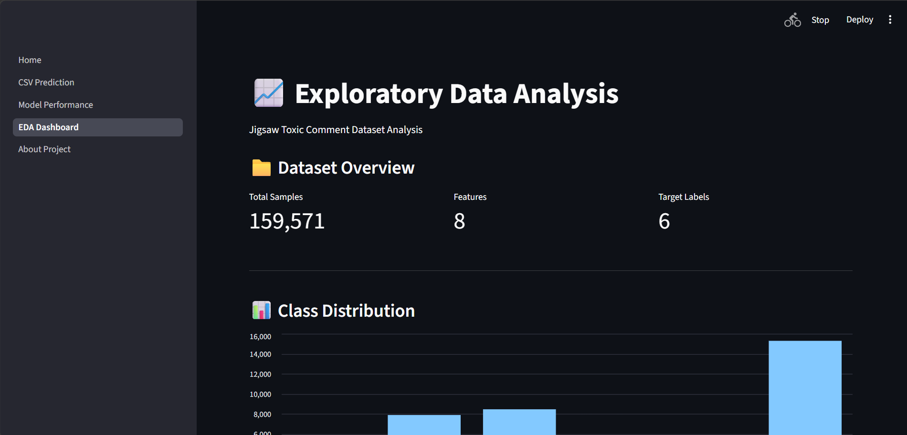
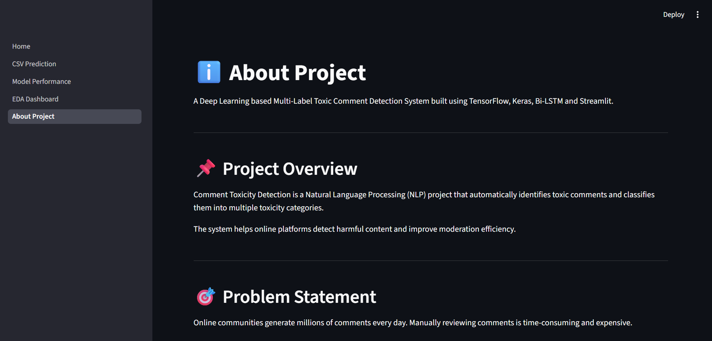

# 🛡️ Comment Toxicity Detection System

A Deep Learning-based NLP application that automatically detects toxic comments and classifies them into multiple toxicity categories using a Bidirectional LSTM (Bi-LSTM) model.

Built with **TensorFlow**, **Keras**, and **Streamlit**, the application provides real-time comment analysis, batch prediction through CSV uploads, model evaluation dashboards, and exploratory data analysis visualizations.

---

## 🚀 Features

- ✅ Single Comment Prediction
- ✅ CSV Batch Prediction
- ✅ Multi-Label Toxicity Classification
- ✅ Toxicity Score Visualization
- ✅ Model Performance Dashboard
- ✅ Exploratory Data Analysis (EDA) Dashboard
- ✅ Download Prediction Results
- ✅ Interactive Streamlit Web Application

---

## 🎯 Toxicity Categories

The model predicts the following categories:

- Toxic
- Severe Toxic
- Obscene
- Threat
- Insult
- Identity Hate

---

## 📸 Application Screenshots

### 🏠 Home Page



### 📂 CSV Prediction



### 📊 Model Performance Dashboard



### 📈 EDA Dashboard



### ℹ️ About Project



---

## 📁 Dataset

**Dataset:** Jigsaw Toxic Comment Classification Dataset

| Metric | Value |
|----------|----------|
| Total Samples | 159,571 |
| Training Samples | 127,656 |
| Validation Samples | 31,915 |

### Class Distribution

| Label | Count |
|---------|---------:|
| toxic | 15,294 |
| severe_toxic | 1,595 |
| obscene | 8,449 |
| threat | 478 |
| insult | 7,877 |
| identity_hate | 1,405 |

The dataset is highly imbalanced, particularly for the **Threat** and **Identity Hate** categories.

---

## 🧹 Data Preprocessing

The following preprocessing steps were applied:

- Convert text to lowercase
- Remove URLs
- Remove punctuation
- Remove numbers
- Remove extra spaces
- Tokenization
- Sequence Padding

### Configuration

```python
MAX_WORDS = 10000
MAX_LEN = 200
```

---

## 🏗️ Model Architecture

```text
Embedding Layer
        ↓
Bidirectional LSTM (64)
        ↓
Dropout (0.3)
        ↓
Dense (64, ReLU)
        ↓
Dense (6, Sigmoid)
```

### Training Configuration

```text
Optimizer      : Adam
Loss Function  : Binary Crossentropy
Epochs         : 5
Batch Size     : 128
```

---

## 📊 Model Performance

### ROC-AUC Score

```text
0.9754
```

### Classification Results

| Class | Precision | Recall | F1 Score |
|---------|---------:|---------:|---------:|
| toxic | 0.70 | 0.85 | 0.77 |
| severe_toxic | 0.48 | 0.43 | 0.46 |
| obscene | 0.75 | 0.87 | 0.80 |
| threat | 0.00 | 0.00 | 0.00 |
| insult | 0.66 | 0.78 | 0.72 |
| identity_hate | 0.33 | 0.02 | 0.04 |

### Threshold Optimization

The prediction threshold was adjusted from **0.5** to **0.3** to improve minority-class detection while maintaining strong overall performance.

---

## 🖥️ Application Modules

### 🏠 Home

Real-time single comment toxicity prediction with category-wise toxicity scores.

### 📂 CSV Prediction

Batch toxicity prediction using uploaded CSV files.

### 📊 Model Performance Dashboard

Visualization of evaluation metrics and class-wise performance.

### 📈 EDA Dashboard

Interactive dataset exploration and visual analytics.

### ℹ️ About Project

Project overview, architecture, technologies used, and future scope.

---

## 📂 Project Structure

```text
Comment-Toxicity-Detection/
│
├── assets/
│   ├── home.png
│   ├── csv_prediction.png
│   ├── performance.png
│   ├── eda.png
│   └── about.png
│
├── app/
│   ├── Home.py
│   │
│   └── pages/
│       ├── 1_CSV_Prediction.py
│       ├── 2_Model_Performance.py
│       ├── 3_EDA_Dashboard.py
│       └── 4_About_Project.py
│
├── artifacts/
│   ├── toxicity_model_final.keras
│   └── tokenizer.pkl
│
├── data/
│
├── src/
│
├── requirements.txt
│
└── README.md
```

---

## ⚙️ Installation

### Clone the Repository

```bash
git clone https://github.com/your-username/comment-toxicity-detection.git
```

### Navigate to Project Directory

```bash
cd comment-toxicity-detection
```

### Install Dependencies

```bash
pip install -r requirements.txt
```

### Run the Application

```bash
streamlit run app/Home.py
```

---

## 🔮 Future Improvements

- BERT-Based Toxicity Classification
- DistilBERT Integration
- Class Weighting Techniques
- Focal Loss Implementation
- REST API Development
- Real-Time Toxic Comment Monitoring
- Improved Minority Class Detection

---

## 👨‍💻 Author

**Gokulraj V**

Machine Learning | Deep Learning | Natural Language Processing

---

## ⭐ Support

If you found this project useful, consider giving it a star on GitHub.